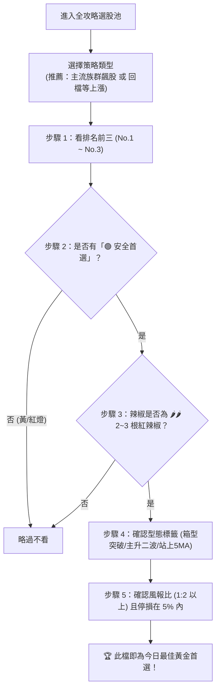
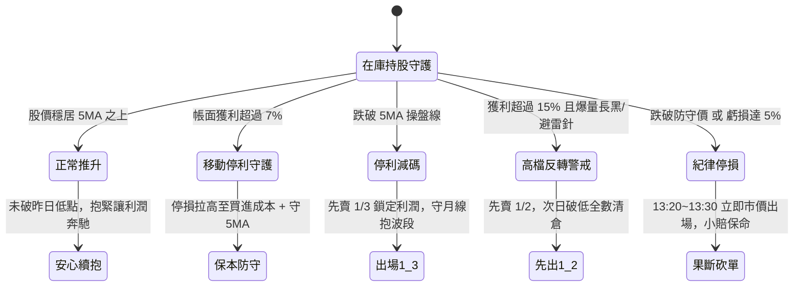

# 📘《技術分析全攻略 · 官方 App 實戰操盤完全使用指南》
> **版本**：2026 旗艦實戰版  
> **核心使命**：將技術分析課程 11 大章節之精華化繁為簡，轉化為普通投資人每天都能輕鬆複製、無腦執行的客觀量化操盤 SOP。

---

## 🧭 目錄導覽
1. [操盤核心心法與系統架構](#第一章-操盤核心心法與系統架構)
2. [全攻略選股池：5 秒挑出黃金標的](#第二章-全攻略選股池5-秒挑出黃金標的)
3. [個股技術分析：進場前 1 分鐘核身審查](#第三章-個股技術分析進場前-1-分鐘核身審查)
4. [持股守護神：全自動盯盤與出場提醒](#第四章-持股守護神全自動盯盤與出場提醒)
5. [贏家每日作戰時間軸 SOP (幾點該做什麼？)](#第五章-贏家每日作戰時間軸-sop-幾點該做什麼)
6. [常見疑難與避雷守則](#第六章-常見疑難與避雷守則)

---

## 第一章 操盤核心心法與系統架構

### 一、贏家操盤五大「永遠」原則
1. **永遠控制風險，嚴格執行停損**：進場前先想輸再想贏，不讓小賠擴大為致命大賠。
2. **永遠集中火力在 2 ~ 5 檔**：絕不買十幾二十檔股票，全神貫注追蹤掌握盤面節奏。
3. **永遠汰弱換強**：手中只留強勢上漲主升股，弱勢不漲果斷剔除換股。
4. **永遠只操作符合技術分析高勝率條件的股票**。
5. **永遠相信技術分析，紀律操作**。

### 二、月獲利 5% 與六年千萬計畫 (複利滾動藍圖)
* **核心哲學**：不求一次暴賺翻倍，追求積小勝為大勝的穩定複利！
* **以 60 萬元本金為例**：
  * 每月 22 個交易日獲利 **5% = 30,000 元**。
  * 拆解為每 2 週只要掌握 1 次 **2.5% 波段價差 = 15,000 元**即可達成！
* **單利年化 60%，六年複利滾動路徑**：
  * 第 1 年：60 萬 ➔ **96 萬** (+36 萬)
  * 第 2 年：96 萬 ➔ **153.6 萬** (+57.6 萬)
  * 第 3 年：153.6 萬 ➔ **245.76 萬** (+92.16 萬)
  * 第 4 年：245.76 萬 ➔ **393.22 萬** (+147.46 萬)
  * 第 5 年：393.22 萬 ➔ **629.15 萬** (+235.93 萬)
  * 第 6 年：629.15 萬 ➔ **1,006.63 萬 (順利突破千萬資產！)**

### 三、系統權限體系說明
* **訪客模式 (輸入 8888)**：僅能使用「個股技術分析 (轉折波主圖)」，其餘選股、做功課、持股守護神等特務功能均受權限保護隱藏。
* **最高指揮官模式 (輸入 Master PIN)**：全系統全功能解鎖，享有選股池、實戰日誌、持股守護神及高階操盤功能。

---

## 第二章 全攻略選股池：5 秒挑出黃金標的

選股池是尋找潛力飆股的雷達。面對跑出來的 10~15 檔股票，**切忌每一檔都看**，只需依照以下標準選拔流程：



### 🎯 黃金個股 5 步眼球掃描法

| 順序 | 檢查指標 | 贏家標準規範 | 淘汰標準 (出現即跳過) |
| :---: | :--- | :--- | :--- |
| **1** | **排名勳章** | 優先鎖定 **No.1、No.2、No.3**（綜合品質評分最高） | 排名過於靠後（十名之後） |
| **2** | **安全評級** | 必須蓋有 **「🟢 安全首選」** 綠色印章（通過 14 大淘汰法，前方無黑K套牢、無乖離過大） | 出現「🟡 警訊注意」或「🔴 嚴禁追高」 |
| **3** | **動能辣椒** | 做多必須為 **紅色辣椒 🌶️🌶️ (2 根) 或 🌶️🌶️🌶️ (3 根)**（量比 > 1.3 倍或漲幅 > 2.5%，大主力積極攻擊） | 只有 1 根（動能平淡）或綠色辣椒（空方摜壓） |
| **4** | **型態與操盤線** | 標籤具備 **`📦 箱型大突破`**、**`🚀 主升第二波`**、**`🥣 圓弧底`** 或 **`🏆 無敵鐵金剛`**，且必須有 **`📈 5MA走升`** 與 **`站上5MA`** | 出現 `↘️ 5MA下彎` 或 `破5MA` |
| **5** | **風報比與停損** | 卡片下方 `⚖️ 風報比` **必須大於 1 : 1.5（最好 1 : 2 以上）**，且 `🛑 建議停損` 風險幅度在 **3% ~ 5% 以內** | 風報比小於 1:1（上方緊貼壓力，肉少骨頭多） |

---

## 第三章 個股技術分析：進場前 1 分鐘核身審查

挑選出心儀標的後，點擊進入 **「📊 個股技術分析」**，只需依序檢查以下 3 個核心區塊：

### 一、做多七大禁忌位置即時排查 (七不買檢核)
圖表正下方設有自動排查儀，進場前確認是否為 **「🟢 完美避開做多七大禁忌」**：
1. **盤底未反轉無三線多排勿進場**：嚴禁盲目摸底猜底。
2. **連漲第 3 根以上位置勿追高**：短線正乖離過大，等回檔量縮再買。
3. **重大壓力關卡前勿進場**：上方距週線/季線/前高若不足 3%，風報比極差。
4. **回檔跌破月線再上漲未過月線勿進場**：下彎月線形成強大蓋頭反壓，反彈碰壁易破底。
5. **趨勢盤整或空頭走勢勿進場做多**：做多只做「頭頭高、底底高」。
6. **連續急漲高檔爆量長紅 K 勿追**：多為主力末升段誘多出貨棒。
7. **多頭進場位置出現價漲黑 K 勿進場**：開高走低出貨黑K，防假突破。

### 二、尾盤進場 K 線 4 大要件檢核 (12:40 ~ 13:30 確認)
1. **價漲量增**：今日成交量 > 20 日均量 1.25 倍。
2. **實體長紅**：當日漲幅 > 2% 且實體大於上下影線。
3. **收盤站穩 5MA**：站在 5 日操盤生命線之上。
4. **收盤突破昨日最高點 (過昨高)**：多方動能實質勝出！

### 三、停損與部位管理設定
* **最適停損價**：直接查閱【🛡️ 實戰停損與風控導航儀】計算出的點位（守進場紅K低點或固定 -5%），**「設好的停損點絕對不可向下更改」**！
* **3 張部位管理法**：
  * 買進 3 張（或分 3 等份）：
  * 第一張（短線）：跌破 5MA 先賣 1/3 獲利入袋；
  * 第二張（中線）：跌破 10MA 調節 1/3；
  * 第三張（長線）：守穩 20MA（月線）一路長抱賺足大波段，破月線全數獲利了結。

---

## 第四章 持股守護神：全自動盯盤與出場提醒

> **位置**：左側選單 **「🤖 實戰秘密特務 (操盤副駕駛)」➔ 分頁 2【🛡️ 我的持股守護神】**

買進股票後，立刻將它交給守護神，徹底告別盤中焦慮盯盤！

### 一、如何登錄持股？
1. 點擊右上角 **【➕ 手動新增持股】**。
2. 輸入股票代號、買進價格、張數（整張/零股、現股/融資）。
3. 點擊確認，股票立即進入 24 小時守護庫存！

### 二、守護神每天為您做什麼？
系統每日盤中自動串接最新撮合行情，為每檔持股計算最新損益並給出具體口令：



### 三、出場結算
賣出股票後，點擊該卡片上的 **【🏁 我賣出了 (結算)】**，選擇全數賣出或分批減碼，系統會**自動計算最終報酬率並移入「📜 實戰戰報紀錄」永久存檔**，完全不需要手動刪除！

---

## 第五章 贏家每日作戰時間軸 SOP (幾點該做什麼？)

嚴格遵守操盤作戰時間軸，克服人性恐慌與貪婪：

```mermaid
timeline
    title 贏家一日實戰作戰時間軸
    08:30 - 09:00 : 盤前準備 : 檢視大盤多空雷達，確認手中持股今日的 5MA 防守價。
    09:00 - 12:40 : 早盤觀望期 : 主力當沖震盪洗盤期！安心工作、切忌早盤衝動追高，不隨盤中晃動起舞。
    12:40 - 13:20 : 關鍵一點鐘 : 全日多空定調黃金期！檢視候選股是否過昨高站穩 5MA；檢視持股是否跌破昨低。
    13:20 - 13:30 : 執行交易 : 該買進尾盤下單，該停損立即砍單，該停利果斷賣出，紀律執行！
    15:00 以後 : 盤後功課 : 打開「全攻略選股池」挑選 1~2 檔黃金標的，列入明日觀察名單。
```

* 🕘 **08:30 ~ 09:00 盤前準備**：
  * 查看大盤燈號，確認持股防守價，心理定錨。
* ☕ **09:00 ~ 12:40 早盤安心上班**：
  * 早盤 09:00~10:30 是主力假突破誘多與當沖洗盤高峰，**此時絕不追高**！技術分析講求「收盤價定多空」，盤中上下震盪 1%~2% 一概不理會。
* 🕜 **12:40 ~ 13:20 關鍵一點鐘 (核心作戰期)**：
  * **買進檢視**：看選出來的候選股，尾盤是否收實體長紅站穩 5MA 且過昨高？
  * **持股檢視（智慧 K 線）**：看手中持股今天的收盤價，有沒有跌破昨天最低點？沒跌破就安心抱牢！
* 🎯 **13:20 ~ 13:30 執行下單**：
  * 若買點成立，尾盤掛單買進；
  * 若持股確認跌破停損價或 5MA，尾盤果斷送出賣單，絕不凹單拖延。
* 🌙 **15:00 以後 盤後功課**：
  * 點開「全攻略選股池」，依照黃金 5 步掃描法挑出 1 ~ 2 檔明天準備觀察的股票，加入自選清單。花費時間不超過 5 分鐘！

---

## 第六章 常見疑難與避雷守則

### 1. 為什麼總是「買進就跌、賣出就漲」？
* **一買就跌的盲點**：早盤看電視利多或大漲 5% 衝動追高，正好接走主力倒出來的貨。贏家只在 12:40~13:30 尾盤買在「回後買上漲」起跑點！
* **一賣就漲的盲點**：該停損第一時間不砍，連跌三天虧了 15% 受不了殺在恐慌低點，正好殺在月線支撐，主力順手低接拉抬。贏家第一時間小賠 3%~5% 果斷出場，絕不拖到破線低點才慌亂殺出！

### 2. 股價創新高到底能不能買？
* **散戶迷思**：98% 散戶認為太高不敢買，因而錯失後面數倍暴利的大飆股（如勤誠 8210 從 100 漲到 260、廣達 2382 從 80 漲到 280）。
* **贏家思維**：多頭趨勢不變的股票會一直創新高！創高當天不追高，等待拉回量縮守穩均線出轉折紅 K 時切入（回後買上漲）。

### 3. 可以向下攤平降低成本嗎？
* ### 🛑 **「實戰波段操盤，嚴禁向下攤平買進！」**
* 股票下跌代表空方佔據絕對優勢，攤平是在加碼正在下跌的弱勢股，只會卡死更多資金，甚至最後演變成腰斬或斷頭的慘劇！

---

## 第七章 大盤同步與滯後補漲實戰全解

### 一、什麼是「大盤同步·滯後補漲」戰法？
1. **同向同構（波形相似度 >= 70%）**：
   個股的高低轉折、底底高、回測洗盤軌跡與大盤加權指數高度重疊，代表該標的受全市場總體資金與多頭氛圍強烈共振，絕非冷門孤兒股。
2. **資金外溢效應（多頭輪動）**：
   在多頭行情的初期，外資與大主力通常先拉抬台積電、聯發科、廣達等一線權值龍頭，把大盤推過關鍵頸線。當權值股攻堅至高檔震盪休整時，場內充沛資金外溢至「走得慢半拍的二線跟隨股」，迎來凶猛的滯後補漲主升浪！
3. **低風險與絕佳風報比**：
   此類股票因走勢滯後，往往剛踩在月線（20MA）或底部平台蓄勢，下檔停損極近（通常僅 3%~5%），而補漲空間可達 6%~12%，風報比高達 1:2.5 以上。

### 二、名單是否天天自動更新？
* **100% 動態滾動更新！** 系統以「最新 40 個交易日」為滑動窗口（Rolling 40 Days），每天根據大盤與個股的最新價格動態重算相似度與 5 日落後差距。
* **補漲滿足**：當個股漲幅追上大盤，落後缺口收斂，系統會自動將其升級為【⚡ 大盤高度同步 (同步推升中)】。
* **新黑馬自動晉升**：若有其他底部整理股被大盤拉開差距，只要結構安全，次日會自動晉級出現在 14 檔名單中！

### 三、大盤回檔/低迷時，還能用滯後補漲嗎？
* 🛑 **大盤回檔時應「暫停使用」！**
* **覆巢之下無完卵**：大盤下跌時市場缺乏外溢資金，此時先前沒漲的股票絕大多數會變成**「假補漲、真補跌」**！
* **App 自動熔斷防禦**：系統內建安全結構過濾，大盤低迷時若無安全標的，App 會直接顯示「目前條件下暫無符合標的，建議空手觀望保持耐心」，絕不為了湊滿名單而硬推爛股票。

### 四、如何第一時間察覺大盤已經開始回檔？（大師三道警戒線）
1. 🚨 **第一道警戒線（短線推升結束，當天收盤立刻知道）**：
   加權指數收盤**「跌破 5MA」**且**「5MA 走平甚至下彎」**！此時第一步就是全面停止追高，短線進入震盪整理。
2. 🚨 **第二道警戒線（形態破壞）**：
   盤中跌破前一波整理低點（如跌破整數大關或前波變盤星線低點），代表多頭「底底高」慣性遭到破壞。
3. 🚨 **第三道警戒線（波段由多轉空）**：
   指數連續 2~3 天跌破 20MA（月線）且月線扣高走平下彎，代表大盤正式進入中期空頭或深度回檔，此時應持股降至最低水位（現金為王）。
* 💡 **在 App 中一眼辨識**：每天早上查看【AI 助教 · 每日市場量化多空雷達】，若標籤轉為 🔴 警戒或顯示 5MA 失守，系統第一時間會警告您降檔防守！

---

## 第八章 實戰高頻 Q&A 疑難全解 (昨晚與今早實戰精華)

### Q1：我在波段策略選了「主流族群飆股」，選出來的是什麼股票？怎麼挑最適合的？買了如何操作？
* **選出的是什麼？**：篩選出全市場熱錢群聚的 Top 主流產業（熱度前 3~5 名），且身為該族群中帶量起漲的第一、二線領頭羊。
* **哪一檔最適合？**：嚴格套用【黃金檢核順序】——
  **排名前三 (No.1~3) ＋ 🟢 安全首選 ＋ 🌶️🌶️ 2~3 根紅辣椒 ＋ 5MA走升站上5MA (或無敵鐵金剛) ＋ 風報比 1:2 以上**。
* **買了如何操作？**：買進後立即於卡片下方登錄至【持股守護神】！以進場紅K低點或 5MA 為防守線。部位採 3 張管理法（破5MA賣1/3、破10MA賣1/3、破月線出清）。

### Q2：選股池已有綠燈 (安全首選)、黃燈 (警訊注意)、紅燈 (嚴禁追高)，還需要看其他燈號嗎？
* **不需要！App 已經自動為您做完「14 大淘汰法檢核」！**
* **綠燈（🟢 安全首選）**：代表通過所有考驗，前方無黑K套牢、無乖離過大、無空排破線。
* **黃燈（🟡 警訊注意）**：代表有融資斷頭、量價背離或均線下彎風險。
* **紅燈（🔴 嚴禁追高）**：代表位階暴漲已達倍數，或當天拉出長上影線主力出貨。
* **結論**：做多只買「🟢 安全首選」，其餘黃紅燈一律略過！

### Q3：綠辣椒（收黑）而且排在第一名（No.1），這種股票到底能不能選？為什麼會推薦？
* **為什麼第一名？**：因為它的均線、型態、籌碼等各項長期指標極度優異（綜合品質評分冠軍），但當天正好遇到「多頭行進中的拉回量縮洗盤」，所以呈現綠辣椒。
* **今天能買嗎？**：
  * **今天尾盤絕對不能盲目急買！**（拉回未止跌，不能在下落時伸手接刀）。
  * **但它是全市場最頂級的「💎 冠軍鎖股伏兵」！**
* **正確出手時機**：放進第一優先自選名單，觀察次日或後續，一旦出現**「轉折紅K」並突破昨日高點**，辣椒由綠轉紅，就是最安全、下檔風險極低的大師級「回後買上漲」起跑點！

### Q4：看到「5MA走升 ＋ 站上5MA（或無敵鐵金剛）＋ 突破型態」，是否尾盤就能直接買？還是要加上排名、安全首選、紅辣椒與風報比？
* **必須加上全部黃金檢核條件！這就是贏家「萬法歸一」的最後防線！**
* 單看「5MA走升＋突破型態」只是【型態成立】；但如果它是冷門邊緣股（無量）、或是警訊注意（前方有大黑K套牢）、或是風報比極差（上方緊貼重壓），買進後勝率依然不高。
* 堅持：**排名前三 ＋ 🟢 安全首選 ＋ 🌶️🌶️ 2~3 根紅辣椒 ＋ 5MA走升站穩 ＋ 風報比 1:2 以上**，全部條件吻合才是出手之時！

### Q5：大盤慢慢轉跌時，要怎麼找出真正能賺錢的股票？
* **觀念切換**：在大盤上漲時找「滯後補漲」，在大盤下跌時找「逆勢抗跌＋相對強度（RS）」！
* **尋找逆勢強勢股**：大盤大跌破線，某檔股票卻逆勢抗跌、底底高、守穩 5MA/20MA，這代表「主力大戶在暗中鎖碼護盤」！
* **大師最高心法**：大盤轉弱時，降低持股水位，多保留現金；「跌市選股，漲市買股」，等大盤重新站回 5MA 的第一天，名單裡的抗跌伏兵就是全市場最強的暴利提款機！

### Q6：大盤滯後補漲股有漲有跌，如何用「安全燈號、趨勢卡、動能辣椒」挑出今日最佳標的？
* **第一步：只鎖定 🟢 安全首選**
  App 已將「滯後補漲雷達」與「選股池」的把關邏輯全面統一！自動為您執行 14 大淘汰檢核與 7 大禁忌排查，排在最前方的皆為結構最安全的標的。黃燈（警訊）與紅燈（嚴禁追高/淘汰）一律不碰！
* **第二步：一眼辨識【今日先鋒】vs【拉回伏兵】**
  * 🌟 **【今日可買·強勢先鋒】**：標記為 **🟢 安全首選 ＋ 📈 5MA走升·站上5MA (或 🏆無敵鐵金剛) ＋ 🌶️ 紅辣椒** 且今日收紅，代表今日正在隨大盤發動，尾盤 1:00~1:25 確認站穩即可進場！
  * 💎 **【拉回量縮伏兵】**：標記為 **🟢 安全首選 ＋ 💎 拉回量縮伏兵 (綠辣椒)**，雖然今日收黑但中多均線結構完好，**今日不追**，先列入明日首選，等次日出現轉折紅 K 站回 5MA 即是低成本伏擊良機！

---

> 💡 **操盤大師金句總結**：  
> **「順勢不逆勢，買強不買弱，買低不追高，停損不套牢，停利不猶豫！」**  
> 每天嚴守 SOP，六年千萬不是夢，紀律操作成就贏家人生！

